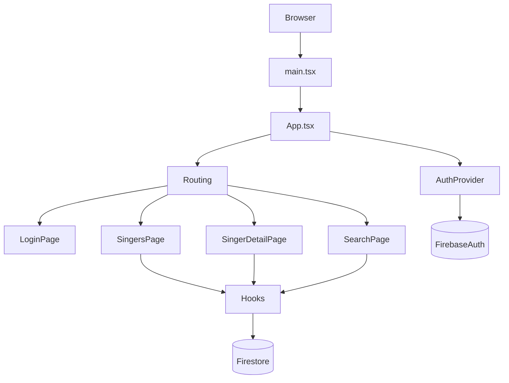

# Guía completa del proyecto `singers-keys-manager`

Esta guía está pensada para entender el código de punta a punta, sin perderse.

## 1) Qué hace la app

Aplicación web para gestionar repertorio de cantantes:

- Crear/editar/eliminar cantantes.
- Asociar canciones a cada cantante.
- Guardar el tono (`key`) y notas por cantante-canción.
- Buscar canciones y ver qué tono usa cada cantante.
- Exportar datos a Excel.

---

## 2) Stack técnico

- **Frontend:** React + TypeScript + Vite.
- **UI:** Tailwind CSS.
- **Routing:** React Router.
- **Backend/BaaS:** Firebase.
  - Auth (Google Sign-In)
  - Firestore (base de datos en tiempo real)
- **Exportación:** `xlsx`.
- **PWA ligera:** `manifest.json` + `sw.js`.

---

## 3) Estructura de carpetas (lo importante)

```text
src/
  main.tsx                 # Bootstrap de React + service worker
  App.tsx                  # Composition root (Router + AuthProvider + Routing)
  router/
    Routing.tsx            # Rutas públicas/privadas
  context/
    AuthContext.tsx        # Estado global de autenticación
  firebase/
    config.ts              # Init Firebase/Auth/Firestore
    collections.ts         # Referencias a colecciones
  pages/
    LoginPage.tsx
    SingersPage.tsx
    SingerDetailPage.tsx
    SearchPage.tsx
  hooks/
    useSingers.ts
    useSongs.ts
    useSingerSongs.ts
  components/
    ui/                    # Botones, modal, inputs, etc.
    singers/               # UI de cantantes
    songs/                 # UI de canciones
    search/                # Resultados de búsqueda
  types/
    index.ts               # Tipos de dominio
  constants/
    keys.ts                # Idiomas y tonos musicales
  utils/
    export.ts              # Excel
```

---

## 4) Modelo mental de arquitectura



---

## 5) Flujo de arranque (startup)

### `src/main.tsx`

1. Monta React en `#root`.
2. Renderiza `<App />` dentro de `StrictMode`.
3. Registra `sw.js` cuando carga la ventana.

### `src/App.tsx`

Compone la app en este orden:

1. `BrowserRouter`
2. `AuthProvider`
3. `Routing`

Ese orden es clave porque las rutas privadas dependen del estado de autenticación.

---

## 6) Routing y protección de rutas

Archivo: `src/router/Routing.tsx`

- Rutas públicas:
  - `/login`
- Rutas privadas:
  - `/singers`
  - `/singers/:singerId`
  - `/search`

`ProtectedRoute`:

- Si `loading` es `true`, muestra spinner.
- Si no hay `user`, redirige a `/login`.
- Si hay `user`, renderiza la ruta.

---

## 7) Autenticación (Google)

Archivo: `src/context/AuthContext.tsx`

Expone:

- `user`
- `loading`
- `signInWithGoogle()`
- `signOut()`

Funcionamiento:

1. Se suscribe a cambios de sesión con `onAuthStateChanged`.
2. `LoginPage` dispara `signInWithGoogle` (popup Google).
3. `MainLayout` permite cerrar sesión con `signOut`.

Archivo de config: `src/firebase/config.ts`

- Inicializa app Firebase.
- Crea `auth` y `googleProvider`.

---

## 8) Base de datos (Firestore)

Colecciones (en `src/firebase/collections.ts`):

- `singers`
- `songs`
- `singerSongs`

### Diseño de datos

Se usa una relación muchos-a-muchos:

- Un cantante puede tener muchas canciones.
- Una canción puede pertenecer a muchos cantantes.

Por eso existe `singerSongs` como tabla de relación.

### Tipos de dominio (`src/types/index.ts`)

- `Singer`: datos del cantante.
- `Song`: canción base (`title`, `language`).
- `SingerSong`: vínculo `singerId + songId` con `key` y `notes`.
- `SingerSongView`: vista enriquecida para UI (join en memoria).

### Aislamiento por usuario

Cada documento guarda `uid`, y todos los queries filtran por `uid` del usuario logueado.

---

## 9) Hooks: corazón de la lógica

## `useSingers`

Archivo: `src/hooks/useSingers.ts`

Responsabilidades:

- Suscribirse en tiempo real a cantantes del usuario.
- `addSinger(name)`
- `updateSinger(id, name)`
- `deleteSinger(id)` con borrado en cascada de `singerSongs`.

Puntos clave:

- Ordena por `createdAt`.
- Si no hay usuario, limpia estado.

## `useSongs`

Archivo: `src/hooks/useSongs.ts`

Responsabilidades:

- Suscribirse en tiempo real a canciones del usuario.
- `getOrCreateSong(title, language)`:
  - Si existe canción con ese título, reutiliza ID.
  - Si no existe, crea una nueva.
- `updateSong(...)`
- `deleteSong(id)` con borrado en cascada en `singerSongs`.

## `useSingerSongs`

Archivo: `src/hooks/useSingerSongs.ts`

Responsabilidades:

- Suscribirse a relaciones cantante-canción.
- Convertir datos a `SingerSongView` (join con singers + songs).
- `getForSinger(singerId)` (detalle de cantante).
- `searchByTitle(term)` (búsqueda global por título).
- `getCommonKeys(singerId)` (top tonos más frecuentes).
- CRUD de la relación:
  - `addSingerSong(...)`
  - `updateSingerSong(...)`
  - `removeSingerSong(...)`

---

## 10) Flujos de negocio (paso a paso)

## A) Añadir cantante

1. En `SingersPage`, botón `+ Añadir`.
2. Se abre `Modal` con `SingerForm`.
3. `SingerForm` llama `onSubmit(name)`.
4. `useSingers.addSinger` guarda en Firestore.
5. `onSnapshot` actualiza la lista automáticamente.

## B) Editar cantante

1. En `SingerCard`, botón `✏️`.
2. `SingerForm` con `initialName`.
3. `useSingers.updateSinger`.

## C) Eliminar cantante

1. En `SingerCard`, botón `🗑️`.
2. `ConfirmDialog`.
3. `useSingers.deleteSinger`:
   - borra cantante
   - borra en batch sus relaciones en `singerSongs`

## D) Añadir canción a un cantante

En `SingerDetailPage`:

1. Botón `+ Canción`.
2. `SongForm` pide título, idioma, tono y notas.
3. `handleAdd`:
   - llama `getOrCreateSong(title, language)` en `useSongs`
   - luego `addSingerSong(singerId, songId, key, notes)` en `useSingerSongs`

Resultado:

- Si la canción ya existe, se reutiliza.
- El tono queda guardado por cantante (no global).

## E) Editar canción de un cantante

1. En `SongRow`, botón `✏️`.
2. `SongForm` en modo edición.
3. Se actualiza relación (`key`, `notes`) con `updateSingerSong`.

## F) Eliminar canción de un cantante

1. En `SongRow`, botón `🗑️`.
2. Confirmación.
3. `removeSingerSong(singerSongId)`.

Nota: elimina la relación para ese cantante, no necesariamente la canción global.

## G) Buscar canciones

1. En `SearchPage`, escribes texto.
2. `searchByTitle(query)` filtra por título en `useSingerSongs`.
3. `SearchResults` agrupa por canción y muestra cantantes + tono.

## H) Exportar a Excel

- `SingersPage` exporta todo el dataset visible.
- `SingerDetailPage` exporta el repertorio de un cantante.
- Función en `src/utils/export.ts`.

---

## 11) Componentes y su rol

### Layout y navegación

- `MainLayout`: header, tabs de navegación, logout, `<Outlet />`.

### Páginas

- `LoginPage`: acceso con Google.
- `SingersPage`: listado principal de cantantes.
- `SingerDetailPage`: repertorio y tonos por cantante.
- `SearchPage`: búsqueda global.

### Componentes de dominio

- `SingerCard`: item de cantante (navegar, editar, eliminar).
- `SingerForm`: formulario crear/editar cantante.
- `SingerKeyProfile`: muestra tonos habituales.
- `SongRow`: item de canción en detalle de cantante.
- `SongForm`: formulario añadir/editar relación canción-cantante.
- `LanguageFilter`: tabs por idioma.
- `SearchResults`: resultados agrupados por canción.

### UI base

- `Button`, `Input`, `Select`, `Modal`, `ConfirmDialog`, `Badge`.

---

## 12) Orden recomendado para leer el código (30-40 min)

1. `src/main.tsx`
2. `src/App.tsx`
3. `src/router/Routing.tsx`
4. `src/context/AuthContext.tsx`
5. `src/firebase/config.ts` y `src/firebase/collections.ts`
6. `src/pages/SingersPage.tsx`
7. `src/hooks/useSingers.ts`
8. `src/pages/SingerDetailPage.tsx`
9. `src/hooks/useSongs.ts`
10. `src/hooks/useSingerSongs.ts`
11. `src/pages/SearchPage.tsx` + `src/components/search/SearchResults.tsx`
12. `src/types/index.ts`, `src/constants/keys.ts`, `src/utils/export.ts`

---

## 13) Puntos importantes para mantenimiento

- No hay tests automatizados actualmente.
- Gran parte de la lógica de negocio vive en hooks.
- No hay backend intermedio: UI -> Firebase directamente.
- Existe caché local en Firestore y SW básico para recursos estáticos.

---

## 14) Resumen ultra corto

- **Auth** controla acceso.
- **Pages** orquestan la UI.
- **Hooks** contienen CRUD + lógica de negocio.
- **Firestore** almacena cantantes, canciones y relaciones.
- **`singerSongs`** es la clave del modelo (tono y notas por cantante-canción).

